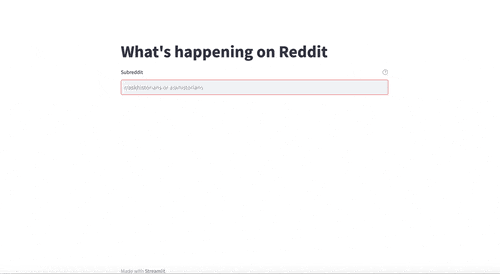

## Taking Streamlit for a spin

This is a simple app aiming to explore streamlit's capabilities.
It retrieves post titles from subbreddits via the Reddit API and displays a wordcloud based on the results.



To run the app as a python module, run the following:

```
pip install -r requirements.txt
streamlit run main.py
```

See [here](https://dimitarmitkov.com/blog/building-cool-things-with-python-part-1) for more details

